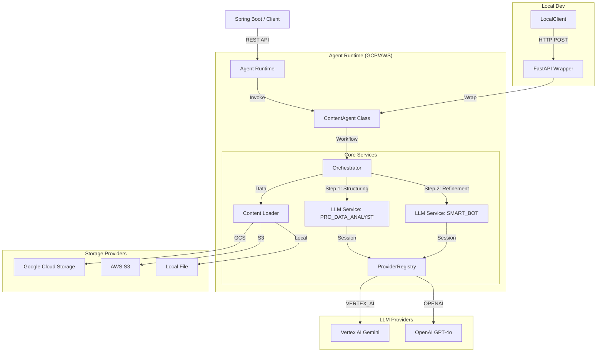
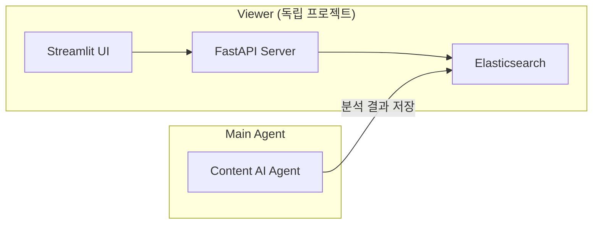

# 콘텐츠 분석 AI Agent 아키텍처 설계 (2026 Modern Edition)

## 1. 시스템 개요
**Content Analysis AI Agent**는 프로젝트 단위로 전달된 콘텐츠(텍스트 또는 문서) 리스트를 수집하여, 심층적인 요약과 분석 인사이트를 제공하는 지능형 서비스입니다. 
본 시스템은 **Google Vertex AI Agent Engine** 배포를 주 목적으로 설계되었으며, 로컬 개발 및 테스트를 위해 FastAPI 래퍼를 제공합니다.

### 핵심 기능
*   **프로젝트 단위 분석:** 다수의 문서를 하나의 맥락으로 통합 분석.
*   **페르소나 기반 분석:** 사용자가 선택한 페르소나(판매자 도우미, 데이터 분석가)에 따른 맞춤형 인사이트 제공.
*   **2단계 분석 파이프라인:** 구조화(Step 1)와 정제(Step 2)를 통한 고품질 분석 결과 생성.

## 2. 하이 레벨 아키텍처 (High-Level Architecture)



## 3. 상세 컴포넌트 설계 (Reasoning Engine Centric)

### 3.1. Agent Interface (Entry Point)
*   **Class:** `ContentAnalysisAgent`
*   **Role:** Agent Engine에 등록될 최상위 클래스. 외부 요청을 받아 오케스트레이터에 전달하고 결과를 반환.
*   **Implementation:** `google-genai` SDK를 사용하여 핵심 추론 및 생성 로직 구현.
*   **Deployment:** 구현된 클래스를 **Vertex AI Agent Engine**을 통해 관리형 런타임에 배포하여 API로 노출.
*   **Methods:**
    *   `set_up()`: 초기화. Agent Engine 라이프사이클 훅.
    *   `analysis(project_id: str, persona: str, contents: List[str]) -> Dict`: 메인 분석 메서드.
*   **FastAPI Wrapper (Local Only):**
    *   `src/main.py`에서 `ContentAnalysisAgent`를 인스턴스화하여 `/analysis` 엔드포인트로 노출.

### 3.2. 데이터 수집 및 처리 제약 조건 (Processing Constraints)
안정적인 메모리 관리와 효율적인 LLM 분석을 위해 다음 제약 조건을 적용합니다.

#### **A. LLM 모델 스펙 및 선정 근거**

**Vertex AI (Gemini) 모델** (2026-02 기준)
| 모델명 | Context Window | Max Output | 특징 | 역할 |
| :--- | :--- | :--- | :--- | :--- |
| **Gemini 2.5 Pro** | **1M Tokens** | 65,535 | 최상위 추론 능력, 안정된 성능 | **Structuring** (1단계 메인 분석) |
| **Gemini 2.5 Flash** | **1M Tokens** | 65,535 | Pro 대비 10배 빠른 속도, 낮은 비용 | **Refinement** (2단계 요약 정제) |
| Gemini 3.0 Pro Preview | 1M Tokens | 32,768* | 최신 Preview, 고급 추론 | 실험/테스트용 |
| Gemini 3.0 Flash Preview | 1M Tokens | 32,768* | 최신 Preview, 빠른 처리 | 실험/테스트용 |

> *Preview 모델은 실제 호출 시 32,768 토큰까지만 안정적으로 반환되는 제약이 있음.

**OpenAI 모델** (2026-02 기준)
| 모델명 | Context Window | Max Output | 가격 (per 1M tokens) | 역할 |
| :--- | :--- | :--- | :--- | :--- |
| **GPT-4o** | **128K Tokens** | 16,384 | $2.50 / $10.00 | **Structuring** (1단계 메인 분석) |
| **GPT-4o-mini** | **128K Tokens** | 16,384 | $0.15 / $0.60 | **Refinement** (2단계 요약 정제) |
| GPT-4.1 | 1M Tokens | 32,768 | - | 대용량 컨텍스트 처리 |
| o1 / o3 | 200K Tokens | 100,000 | $10.00 (reasoning) | 복잡한 추론 작업 |
| o4-mini | 200K Tokens | 100,000 | - | 빠른 reasoning, 비용 효율 |

> **[주의]** o-series 모델은 내부 reasoning tokens가 output으로 과금되므로 실제 비용이 예상보다 높을 수 있음.

#### **B. 제약 설정 (Constraints)**
*   **파일 크기 제한: 10MB**
    *   **근거:** 한글 2,000자 * 1,000건(약 200만 자) 처리 시 물리적 크기는 약 **6~8MB**(UTF-8 기준). 안전 마진을 고려하여 **10MB**로 설정. 이 크기는 Cloud Run 메모리(수 GB) 내에서 안전하게 로드 가능함.
*   **토큰 제한:** 단일 호출 시 Gemini 2.5 Pro의 Context Window(2M) 내에서 처리가 가능하도록 관리.

### 3.4. 2단계 분석 오케스트레이션 (2-Step Analysis Pipeline)
*   **Orchestrator Logic:**
    1.  **Validation:** `RequestContentLoader`를 통해 파일 크기 검증(10MB) 및 일괄 로드.
    2.  **Step 1: Structuring (PRO_DATA_ANALYST):**
        *   비정형 텍스트를 입력받아 카테고리별 분류, 감정 점수 계산, 핵심 하이라이트 추출 수행.
        *   `StructuredAnalysisResult` 스키마에 따라 정형 데이터 생성.
    3.  **Step 2: Refinement (Persona-based):**
        *   1단계의 정밀 분석 데이터를 바탕으로 사용자가 선택한 페르소나에 맞춰 요약문 정제 및 길이 최적화.
        *   `StructuredAnalysisRefinedResponse` 스키마 사용.
    4.  **Merging:** 두 단계의 결과를 병합하여 최종 `StructuredAnalysisResult` 반환.

### 3.5. LLM Service (Reliability & Multi-Provider Support)
*   **역할:** `Orchestrator`와 LLM Provider 사이의 통신을 전담하며, Provider 중립적인 세션 관리.
*   **멀티 Provider 지원:**
    *   **ProviderRegistry:** Provider Factory를 등록하고 관리하는 중앙 레지스트리.
    *   **LLMProviderFactory (ABC):** Provider별 세션 생성 팩토리 인터페이스.
    *   **LLMProviderSession (ABC):** Provider 중립적 세션 인터페이스.
    *   **지원 Provider:** Vertex AI (Google), OpenAI (환경변수 `LLM_PROVIDER`로 선택).
*   **재시도 전략 (Retry Policy):**
    *   **Quota Error (429):** Exponential Backoff with Jitter 적용.
    *   **Validation Error:** `ValidationErrorHandler`를 통한 자동 재시도 및 자가 교정 수행.

## 4. 프롬프트 엔지니어링 (Persona Definition & Controlled Generation)
*   **System Prompt Structure:** 
    *   `base.jinja2`를 상속받아 모든 페르소나의 공통 언어 규칙 및 행동 양식을 정의.
    *   **Controlled Generation:** `GenerationConfig`의 `response_mime_type="application/json"` 및 `response_schema`를 사용하여 구조적 출력을 강제.
    *   **Schema-Driven Instructions:** Pydantic 모델(`StructuredAnalysisResult` 등)의 `Field(description=...)`가 LLM에게 세부 지침을 전달하는 역할을 수행.
    *   **Temperature Strategy:** `PersonaType`별로 최적화된 Temperature 설정 (0.1 ~ 0.7) 적용.
*   **CUSTOMER_FACING_ANALYST (구 판매자 도우미):**
    *   **Goal:** 고객의 관점에서 제품 가치를 발굴하고 신뢰를 형성.
    *   **Tone:** 정중함, 진정성 있음, 고객 중심적. (Temp: 0.7)
*   **PRO_DATA_ANALYST (구 데이터 분석가):**
    *   **Goal:** 데이터 이면의 패턴과 사실을 냉철하게 분석.
    *   **Tone:** 객관적, 논리적, 구조적. (Temp: 0.1)
*   **CUSTOMER_FACING_SMART_BOT (리뷰 요약 봇):**
    *   **Goal:** 방대한 리뷰의 핵심을 효율적으로 요약하여 합리적 의사결정 지원.
    *   **Tone:** 절제됨, 스마트함, 이모지 배제, 명확한 사실 전달. (Temp: 0.3)

## 5. 기술 스택 (Technology Stack)
*   **Runtime:** Python 3.10+
*   **IDE:** IntelliJ IDEA (Ultimate/Community with Python Plugin)
*   **Core Framework:** Pure Python (No Web Framework Dependency in Core)
*   **AI Model (Multi-Provider):**
    *   **Vertex AI (기본):**
        *   Gemini 2.5 Pro (Structuring) / Gemini 2.5 Flash (Refinement)
        *   Gemini 3.0 Pro/Flash Preview (실험용)
    *   **OpenAI:**
        *   GPT-4o (Structuring) / GPT-4o-mini (Refinement)
        *   GPT-4.1 (대용량 컨텍스트), o1/o3/o4-mini (고급 추론)
    *   **Provider 선택:** 환경변수 `LLM_PROVIDER` (VERTEX_AI | OPENAI)
*   **Deployment:**
    *   **Prod (GCP):** Vertex AI Agent Engine (Managed Runtime).
    *   **Prod (AWS):** Lambda + API Gateway (SAM 배포).
    *   **Dev/Test:** Local FastAPI Wrapper.
*   **Infrastructure:**
    *   **Storage:** Google Cloud Storage, AWS S3, Local File.
*   **Secret Management (Configuration):**
    *   **로컬 환경:** `.env.local` 파일 또는 `EnvSecretProvider`.
    *   **GCP 환경:** Google Secret Manager (`GSMSecretProvider`).
    *   **AWS 환경:** AWS Secrets Manager (`AWSSecretsProvider`).
    *   **Naming Convention:** `{ENV}-content-ai-config` (예: `dev-content-ai-config`).
    *   **동작 방식:** 앱 시작 시 `ENV` 프로필에 맞는 JSON Secret을 통째로 가져와 설정(`Settings`)에 주입. `.env.local`이 없고 `ENV` 변수도 없으면 실행 차단.
    *   **장점:** 설정값의 버전 관리 용이, 런타임 API 호출 최소화.
*   **Dev Ops:**
    *   **Local:** Docker, `pip` (via `pyproject.toml`).
    *   **Production (GCP):** `google-genai` SDK + Vertex AI Agent Engine.
    *   **Production (AWS):** `openai` SDK + Lambda.

## 6. 분석 결과 뷰어 (Content Analysis Viewer)

ES에 저장된 분석 결과를 웹 UI로 시각화하여 조회할 수 있는 **독립 프로젝트**입니다.

### 6.1. 아키텍처


### 6.2. 주요 특징
*   **독립 배포:** 메인 Agent와 분리되어 독립적으로 배포 가능
*   **최소 의존성:** ES 연결 + FastAPI만 필요 (GCP SDK 불필요)
*   **AWS Lambda 지원:** API Gateway + Lambda 배포 지원
*   **Streamlit UI:** 로컬 개발용 Streamlit 뷰어 제공

### 6.3. 디렉토리 구조
```
viewer/                     # 독립 프로젝트 루트
├── pyproject.toml          # 독립 의존성 관리
├── viewer/
│   ├── main.py             # FastAPI 엔트리포인트
│   ├── api/                # API 라우터
│   ├── services/           # ES 조회 서비스
│   └── streamlit/          # Streamlit 뷰어 앱
└── README.md
```

### 6.4. 실행 방법
```bash
cd viewer
pip install -e ".[server,streamlit]"

# FastAPI 서버 (API 제공)
uvicorn viewer.main:app --reload --port 8787

# Streamlit 뷰어 (웹 UI)
streamlit run viewer/streamlit/app.py --server.port 8701
```

### 6.5. HTML 리포트 생성
*   **GenerationViewer:** 분석 결과를 아마존 스타일 HTML 또는 PDF로 변환
*   **기능:**
    *   `generate_amazon_style_html()`: 인터랙티브 HTML 보고서 생성
    *   `generate_pdf_optimized_html()`: PDF 출력용 HTML 생성
    *   모달 창을 통한 원본 콘텐츠 확인 기능