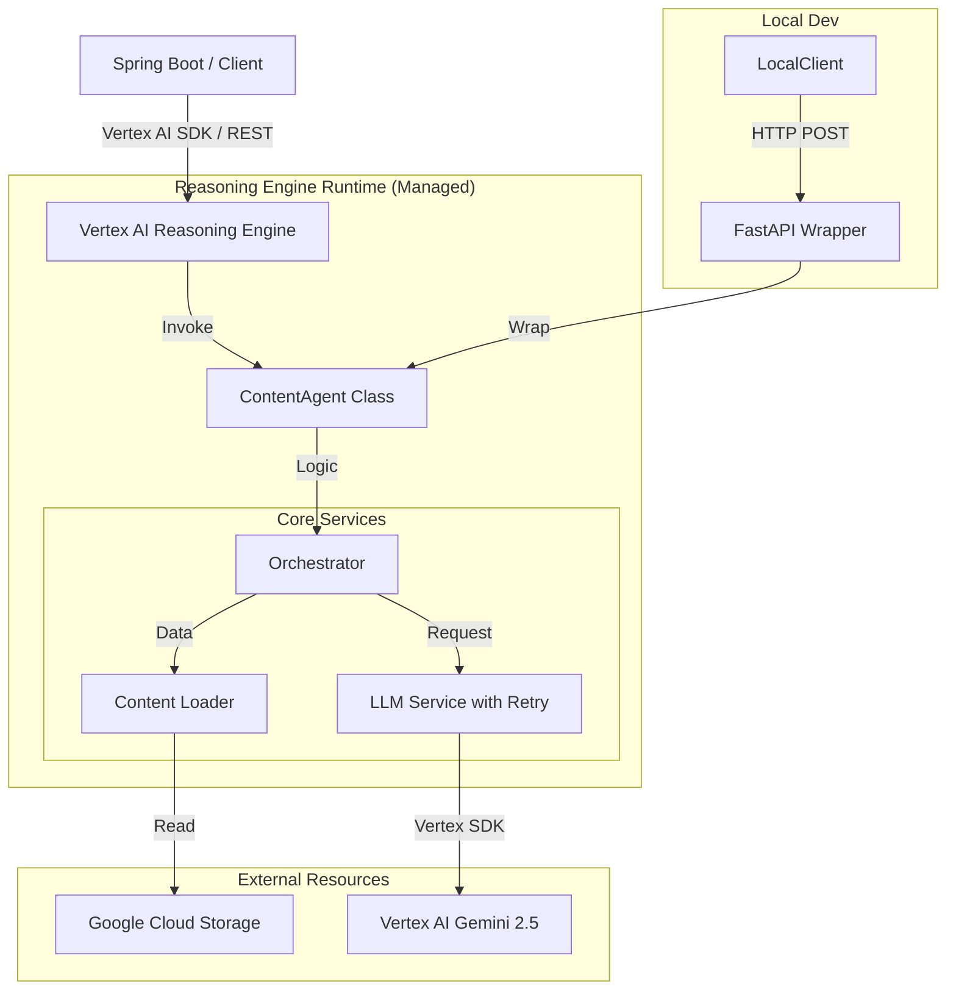

# 콘텐츠 분석 AI Agent 아키텍처 설계

## 1. 시스템 개요
**Content Analysis AI Agent**는 프로젝트 단위로 전달된 콘텐츠(텍스트 또는 문서) 리스트를 수집하여, 심층적인 요약과 분석 인사이트를 제공하는 지능형 서비스입니다. 
본 시스템은 **Google Vertex AI Reasoning Engine** 배포를 주 목적으로 설계되었으며, 로컬 개발 및 테스트를 위해 FastAPI 래퍼를 제공합니다.

### 핵심 기능
*   **프로젝트 단위 분석:** 다수의 문서를 하나의 맥락으로 통합 분석.
*   **페르소나 기반 분석:** 사용자가 선택한 페르소나(판매자 도우미, 데이터 분석가)에 따른 맞춤형 인사이트 제공.
*   **하이브리드 청킹:** 데이터 규모에 따른 Map-Reduce(Flash) / Single-Pass(Pro) 자동 분기.

## 2. 하이 레벨 아키텍처 (High-Level Architecture)

## 3. 상세 컴포넌트 설계 (Reasoning Engine Centric)

### 3.1. Agent Interface (Entry Point)
*   **Class:** `ContentAnalysisAgent`
*   **Role:** Reasoning Engine에 등록될 최상위 클래스. 외부 요청을 받아 오케스트레이터에 전달하고 결과를 반환.
*   **Methods:**
    *   `set_up()`: 초기화. Reasoning Engine 라이프사이클 훅.
    *   `query(project_id: str, persona: str, contents: List[str]) -> Dict`: 메인 분석 메서드.
*   **FastAPI Wrapper (Local Only):**
    *   `src/main.py`에서 `ContentAnalysisAgent`를 인스턴스화하여 `/analyze` 엔드포인트로 노출.

### 3.2. 데이터 수집 및 처리 제약 조건 (Processing Constraints)
안정적인 메모리 관리와 효율적인 LLM 분석을 위해 다음 제약 조건을 적용합니다.

#### **A. Gemini 모델 스펙 및 선정 근거**
| 모델명 | Context Window | 특징 | 역할 |
| :--- | :--- | :--- | :--- |
| **Gemini 2.5 Pro** | **2M Tokens** | 최상위 추론 능력, 안정된 성능 | **Reduce / Single Pass** (메인 분석) |
| **Gemini 3.0 Pro** | **2M Tokens** | (Preview) 차세대 추론 모델 | 실험 및 고도화용 |
| **Gemini 2.5 Flash** | **1M Tokens** | Pro 대비 10배 빠른 속도, 낮은 비용 | **Map Phase** (대량 청크 요약) |
| **Gemini 1.5 Pro** | **1M/2M Tokens** | (Legacy) 긴 컨텍스트 처리의 표준 | 예비/비교군 |

#### **B. 제약 설정 (Constraints)**
*   **파일 크기 제한: 10MB**
    *   **근거:** 한글 2,000자 * 1,000건(약 200만 자) 처리 시 물리적 크기는 약 **6~8MB**(UTF-8 기준). 안전 마진을 고려하여 **10MB**로 설정. 이 크기는 Cloud Run 메모리(수 GB) 내에서 안전하게 로드 가능함.
*   **청크/라우팅 기준: 500,000 Tokens (500k)**
    *   **근거:** 한글 200만 자는 약 **300만 토큰**으로, 단일 모델 한계(2M)를 초과함. 따라서 2M 내에서 안전하게 동작하며 네트워크 타임아웃을 방지할 수 있는 보수적 수치인 **500k**를 청킹 및 분산 처리(Map-Reduce) 기준으로 설정.

### 3.4. 하이브리드 청킹 및 오케스트레이션
*   **Orchestrator Logic:**
    1.  **Validation:** `RequestContentLoader`를 통해 파일 크기 검증(10MB) 및 일괄 로드. (`src/loaders`의 `GCSLoader`, `LocalFileLoader` 위임)
    2.  **Token Counting:** Vertex AI SDK를 사용하여 전체 텍스트의 토큰 수 계산.
    3.  **Routing & Execution:** 
        *   **Total Tokens < 500k:** **Single Pass** (Gemini 2.5 Pro). 한 번에 전체 컨텍스트 입력.
        *   **Total Tokens >= 500k:** **Map-Reduce Strategy**.
            *   **Map:** 데이터를 500k 토큰 단위 청크로 분할 -> Gemini 2.5 Flash로 병렬 요약.
            *   **Reduce:** 중간 요약본들을 모아 Gemini 2.5 Pro로 최종 통합 분석.
    4.  **Archiving:** 분석 완료 후 Elasticsearch에 결과 저장.

### 3.5. LLM Service (Reliability & Resilience)
*   **역할:** `Orchestrator`와 Vertex AI 사이의 통신을 전담하며, 네트워크 불안정 및 할당량 제한에 대응.
*   **재시도 전략 (Retry Policy via Tenacity):**
    *   **Quota Error (429):** Exponential Backoff 적용 (Max 5회, 최대 5분 대기).
    *   **Server/Network Error (5xx):** Random Exponential Backoff 적용 (Max 3회, 최대 60초 대기).
*   **Event Loop 안전성:** 비동기 gRPC 호출 시 발생할 수 있는 Event Loop 충돌을 방지하기 위한 안전한 호출 패턴 적용.

## 4. 프롬프트 엔지니어링 (Persona Definition & Controlled Generation)
*   **System Prompt Structure:** 
    *   `base.jinja2`를 상속받아 모든 페르소나의 공통 언어 규칙 및 행동 양식을 정의.
    *   **Controlled Generation:** `GenerationConfig`의 `response_mime_type="application/json"` 및 `response_schema`를 사용하여 구조적 출력을 강제.
    *   **Schema-Driven Instructions:** Pydantic 모델(`DetailedAnalysisResponse` 등)의 `Field(description=...)`가 LLM에게 세부 지침을 전달하는 역할을 수행.
    *   **Temperature Strategy:** `PersonaType`별로 최적화된 Temperature 설정 (0.1 ~ 0.7) 적용.
*   **CUSTOMER_FACING_ANALYST (구 판매자 도우미):**
    *   **Goal:** 고객의 관점에서 제품 가치를 발굴하고 신뢰를 형성.
    *   **Tone:** 정중함, 진정성 있음, 고객 중심적. (Temp: 0.7)
*   **PRO_DATA_ANALYST (구 데이터 분석가):**
    *   **Goal:** 데이터 이면의 패턴과 사실을 냉철하게 분석.
    *   **Tone:** 객관적, 논리적, 구조적. (Temp: 0.1)
*   **CUSTOMER_FACING_SMART_BOT (리뷰 요약 봇):**
    *   **Goal:** 방대한 리뷰의 핵심을 효율적으로 요약하여 합리적 의사결정 지원.
    *   **Tone:** 절제됨, 스마트함, 이모지 배제, 명확한 사실 전달. (Temp: 0.3)

## 5. 기술 스택 (Technology Stack)
*   **Runtime:** Python 3.10+
*   **IDE:** IntelliJ IDEA (Ultimate/Community with Python Plugin)
*   **Core Framework:** Pure Python (No Web Framework Dependency in Core)
*   **AI Model:** Gemini 2.5 Pro / 3.0 Pro (Vertex AI)
*   **Deployment:** 
    *   **Prod:** Google Vertex AI Reasoning Engine.
    *   **Dev/Test:** Local FastAPI Wrapper.
*   **Infrastructure:**
    *   **Google Cloud Storage:** Raw Content.
*   **Secret Management (Configuration):**
    *   **로컬 환경:** `.env.local` 파일 사용.
    *   **배포 환경:** Google Secret Manager의 **JSON Secret** 로드.
    *   **Naming Convention:** `{ENV}-content-ai-config` (예: `dev-content-ai-config`).
    *   **동작 방식:** 앱 시작 시 `ENV` 프로필에 맞는 JSON Secret을 통째로 가져와 설정(`Settings`)에 주입. `.env.local`이 없고 `ENV` 변수도 없으면 실행 차단.
    *   **장점:** 설정값의 버전 관리 용이, 런타임 API 호출 최소화.
*   **Dev Ops:** 
    *   **Local:** Docker (Redis 전용), `pip` (Python 의존성 관리).
    *   **Production:** Vertex AI SDK (Reasoning Engine Deployment).